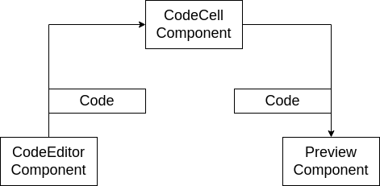
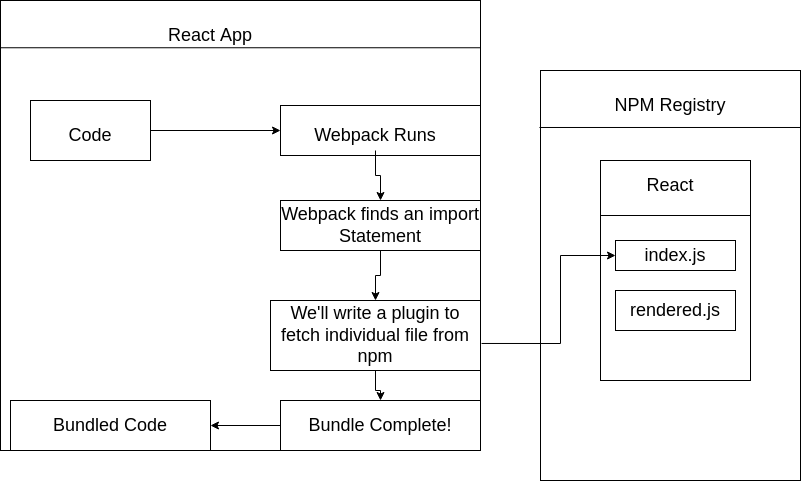
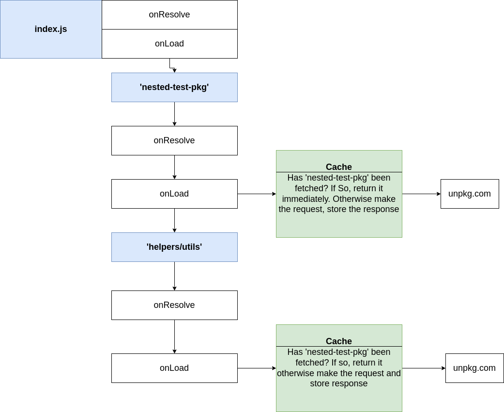
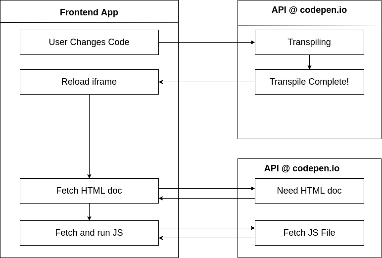
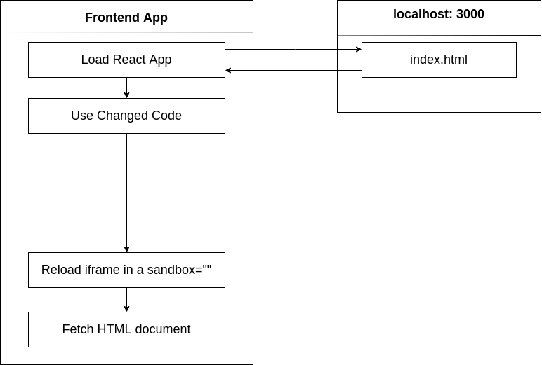
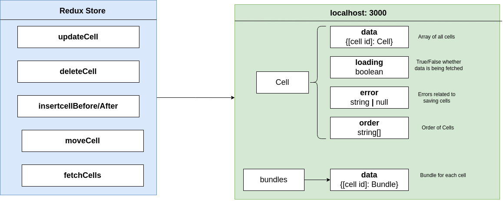
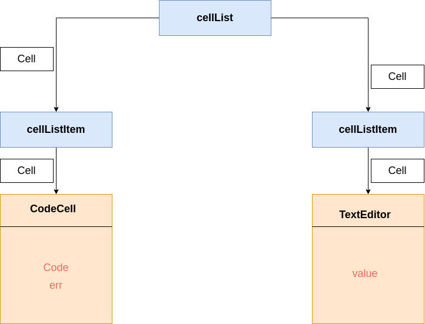
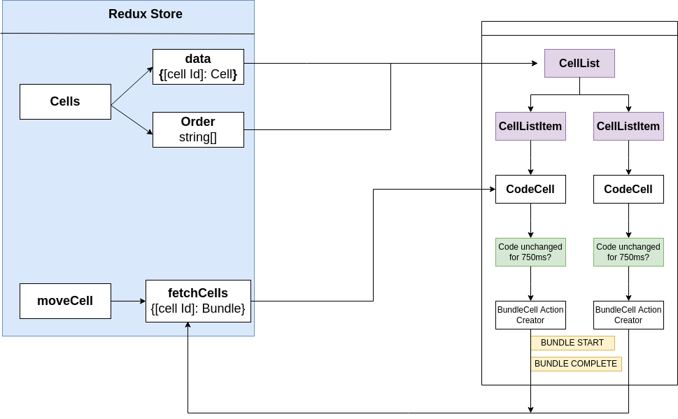

# Browser Based Code Editor
This is a CLI built on a package-based architecture to launch an interactive development environment for writing and documenting Code on the browser.

This README will explain some of the technical challenges faced during the buiding process and their solutions along with the general architecture of the module.

To try out the module you can install it from this [link](https://www.npmjs.com/package/@mutua-cli/local-client)

## Features
1. In-Browser code Transpiling and Processing
2. Security against Potential security exploits.
3. Enables safe execution of User-provided code directly in the Browser
4. Launches and runs a Code Editor directlly in the browser (Same editor to VS Code's)
5. Leverages Web Assembly to run a code bundler directly in the Browser

## How it Works
1. User runs the command `cli serve` on the command line
2. This starts up a server on `localhost:4005`
3. User can now navigate onto that url and write code into an editor
4. Code will be bundled in the browser
5. Code will then be executed in an iframe

## App Structure 

## Challenges
1. Code will be provided to PreviewComponent as a String and needs to be executed safely
2. The code might have advanced JS syntax(e.g JSX) in it that the browser can't execute
3. The code might have import statements for other JS Files or CSS, which have to be dealt with before executing the code

## Remote Vs Local Bundling/Transpiling
**Remote**
1. Can cache doownloaded NPM moduless to bundle code fatser
2. Works better for users with slow devices or limited internet connections.

**Local**
1. Removes an extra request to the API aserver - Faster Code Execution
2. No need to maintain an API Server
3. Less complexity - no moving code back and forth

**Local Bundling Solution**

Using ***ESBuild*** for both code transpiling and bundling and ***unpkg*** to access the NPM Registry.

**Bundling Process**

## Implementing a Caching Layer

## Considerations around Code Execution
1. User-provided code might throw errors and cause the program to crash
2. User-provided code might mutate the DOM, causing the program to crash
3. A user might accidentally run code provided by another malicious user
   
## Implementing a Secure Environment
**Direct access between the parent and child frames is allowed when:**
1. The iframe element does not have a 'sandbox' property, or has a 'sandbox="allow-same-origin" property
2. The parent HTML doc and the frame HTML doc from the same: Domain, Port and Protocol(http vs https)

   All three considerations were solved by executing the user's code in an iframe with direct communication disabled

## The Full Flow

### Example of how the Full Flow is implemented on Codepen

### Modifications
1. Eliminate the extra API server- hence whenever the user needs to execute some code, there is no need to make an extra request to obtain the HTML document(which is largely unmodified)
2. Reload the iframe in a sandbox to eliminate connection between the parent and child
    - Users won't be able to use some in-browser features e.g cookies and localStorage in their code.

## Redux Store Design For the Cells
This is a flow chart explaining the mechanism behind the operation of the `cells` reducer 

## Extracting State from Text Cell

## Connecting Bundles in Redux
### Process
1. Take the store and data pieces of state and wire them up with a selector and provide an ordered list of cells to the **cellList** component.
2. **CellList** then generates some number of **cellListItem** components (CodeCells)
3. If the code belonging to a cell is unchanged after 750ms, call a bundle cell action with it.
4. After calling the BundleCell Action Creator, immediately dispatch an action of the type `BUNDLE START` to signal the bundling process has started for a certain cell.
5. When the bundle is created by the bundle cell action creator, dispatch an action of type `BUNDLE COMPLETE` with the results of the bundle and an possible errors.
6. Receive both actions in the bundles reducer and use that to update some piece of state and communicate that back to the **Code Cell** component. 
7. The **Code Cell** component can then communicate the output of the bundle down to the `PreView` component.

### Flow Chart

## Using Commander to build the CLI
1. **serve.ts** Describes what to do when a user runs the `serve` command.
2. **publish.ts** Describes what to do when a user runs the `publist` command
3. **login.ts** Describes what to do when a user runs the `login` command. 
4. **index.ts** Main location for assembling the CLI